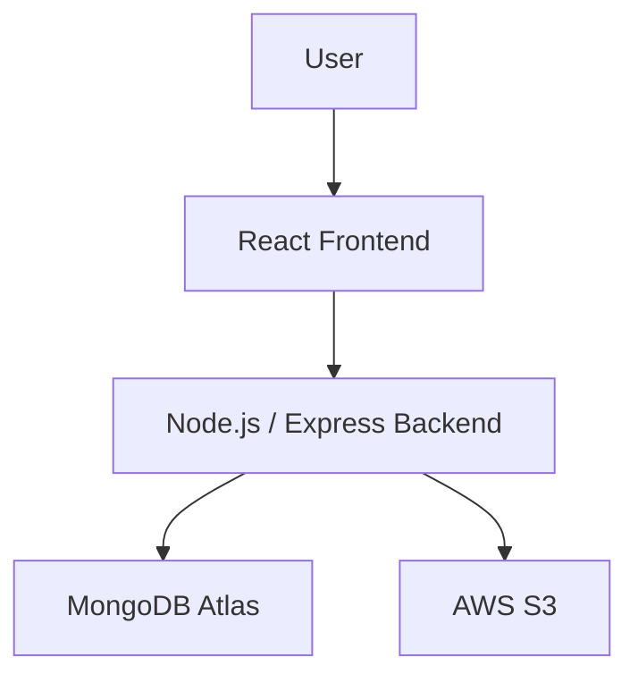

# BuddyTalk — AAC Communication Platform

BuddyTalk is a web-based Augmentative and Alternative Communication (AAC) platform that helps children with communication difficulties communicate using picture-based communication cards and text-to-speech. It gives caregivers a simple way to set up and personalize a communication board for their child.

## Overview

Children with communication difficulties often need a simple, reliable way to express themselves. BuddyTalk addresses this with a tap-to-speak AAC board: a child taps picture cards to build a sentence, which is spoken aloud automatically. Caregivers can personalize the board for their child — organizing cards into folders, uploading their own images and audio, and adjusting accessibility settings — all behind a secure account system.

## Key Features

- Picture-based AAC communication board with a home screen and topic folders
- Sentence building by tapping cards, with word removal and a full clear option
- Text-to-speech on every card tap, using the browser's Web Speech API
- User authentication, including registration, login, logout, and forgot/reset password
- Per-account child profile (name, gender, voice preference, grid size)
- Caregiver media uploads — custom card images (gallery or camera) and custom audio (file upload or in-browser recording)
- Card and folder organization with drag-to-reorder and position save/reset
- Settings Password — a separate short PIN that locks the Settings panel
- Responsive layout for desktop, tablet, and mobile

## Technology Stack

| Component | Technology |
|---|---|
| Frontend | React 19, Vite |
| Backend | Node.js, Express |
| Database | MongoDB Atlas |
| Storage | AWS S3 (optional) |
| Text-to-Speech | Web Speech API (browser-native) |

## System Architecture



The frontend communicates with the backend through the Express API. The backend handles authentication, database operations, and communication with AWS S3.

## Project Structure

```text
BuddyTalk/
├── frontend/
├── backend/
├── assets/
├── audio-generation/
├── docs/
└── README.md
```

## Setup

### Prerequisites

- Node.js (v20 or later)
- A MongoDB Atlas cluster
- An AWS S3 bucket (optional, for card images and caregiver media)
- SMTP credentials (optional, for password-reset emails)

### Clone the repository

```bash
git clone <repository-url>
cd BuddyTalk
```

### Backend installation

```bash
cd backend
npm install
```

### Frontend installation

```bash
cd ../frontend
npm install
```

### Environment variables

Create a `.env` file inside `backend/`:

```
MONGODB_URI=<your-mongodb-connection-string>
JWT_SECRET=<your-jwt-secret>
FRONTEND_ORIGIN=<your-frontend-url>

# Optional — AWS S3
CARD_IMAGE_BASE_URL=<your-s3-bucket-url>

# Optional — email (password reset)
SMTP_HOST=<your-smtp-host>
SMTP_PORT=<your-smtp-port>
SMTP_USER=<your-smtp-username>
SMTP_PASS=<your-smtp-password>
MAIL_FROM=<your-sender-email>

# Optional — Google Sign-In
GOOGLE_CLIENT_ID=<your-google-client-id>
GOOGLE_CLIENT_SECRET=<your-google-client-secret>
```

Create a `.env.local` file inside `frontend/`:

```
VITE_API_URL=<your-backend-url>
VITE_GOOGLE_CLIENT_ID=<your-google-client-id>
```

### Start backend

```bash
cd backend
npm start
```

Runs at `http://localhost:5000`.

### Start frontend

```bash
cd frontend
npm run dev
```

Runs at `http://localhost:5173`.

## Environment Variables

| Variable | Required | Description |
|---|---|---|
| `MONGODB_URI` | Yes | MongoDB Atlas connection string |
| `JWT_SECRET` | Yes | Secret used to sign session cookies |
| `FRONTEND_ORIGIN` | Yes | Allowed frontend origin for CORS |
| `CARD_IMAGE_BASE_URL` | No | AWS S3 base URL for card images/media |
| `SMTP_HOST` / `SMTP_PORT` / `SMTP_USER` / `SMTP_PASS` / `MAIL_FROM` | No | Email configuration for password reset |
| `GOOGLE_CLIENT_ID` / `GOOGLE_CLIENT_SECRET` | No | Google Sign-In configuration |
| `VITE_API_URL` | Yes | Backend URL used by the frontend |
| `VITE_GOOGLE_CLIENT_ID` | No | Google Sign-In client ID for the frontend |

## Usage

1. Register for a new account using an email and password.
2. Sign in and create a child profile.
3. Open the AAC board and tap cards to build a sentence, which is spoken aloud.
4. Open a topic folder to access more cards, or use Settings to personalize the board.
5. Add custom cards with your own images and audio from the Settings panel.
6. Use the Settings Password to lock access to the Settings panel when needed.


